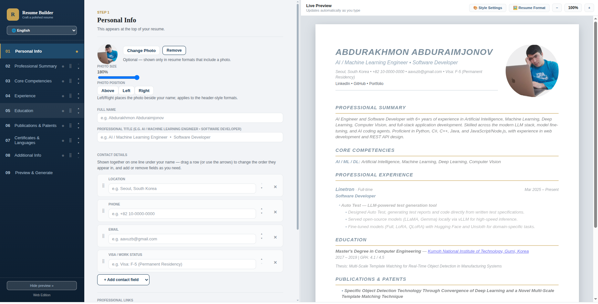
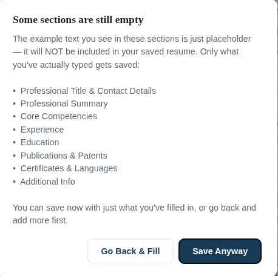
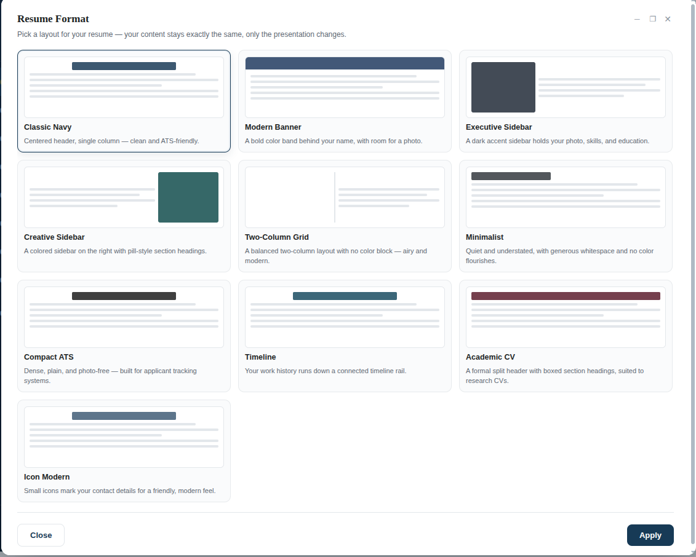
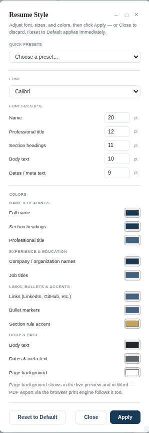
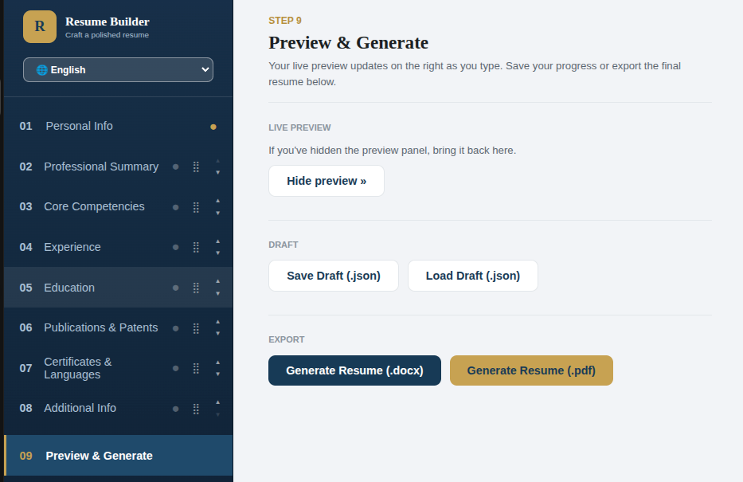
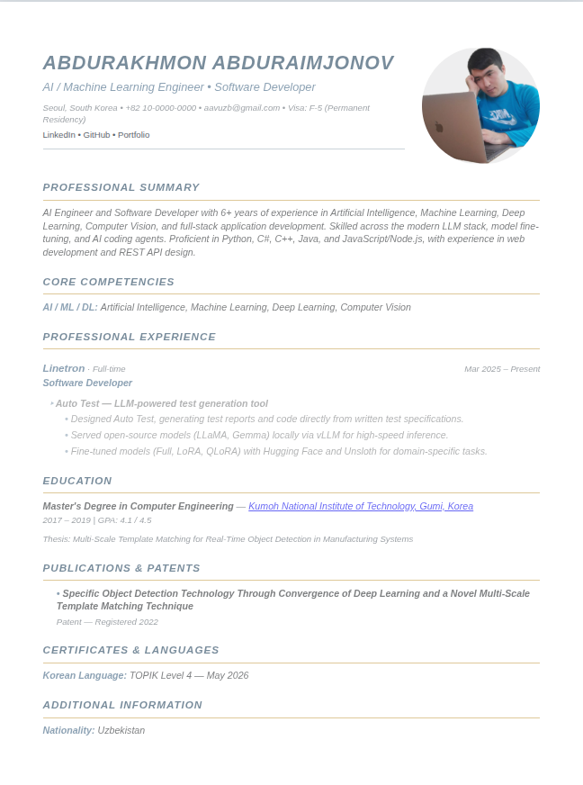
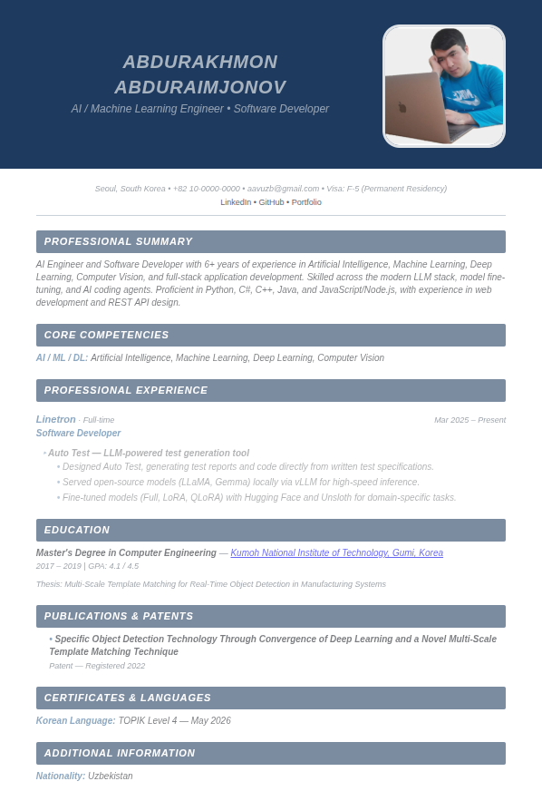
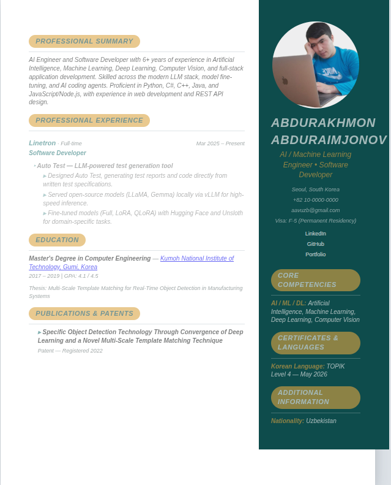
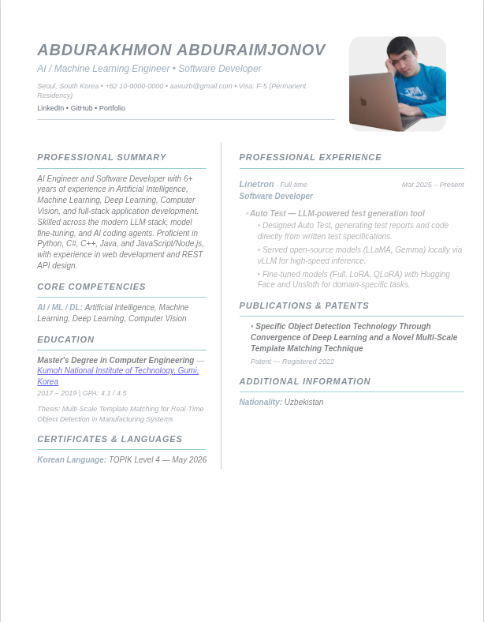
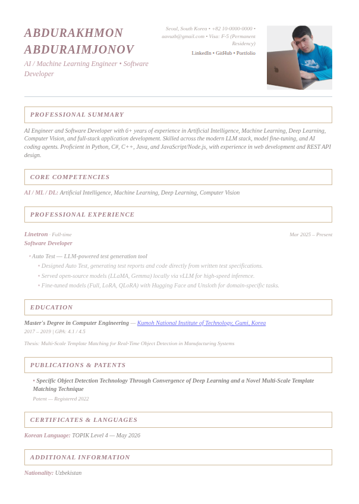

# Resume Builder

**A free, browser-based resume builder — no installs, no sign-ups, no accounts.**
Pick a layout, fill in your own information, and export a polished, real `.docx` or a searchable vector `.pdf` in minutes.

### 🔗 Try it now — it's already live: **[aavuzb.github.io/Resume-Builder](https://aavuzb.github.io/Resume-Builder/)**

Anyone can open that link and start building a resume today, right in the browser. Nothing to install, nothing to configure.



---

## ⚠️ Placeholder text is only an example — it is never saved

The moment you open Resume Builder, the live preview on the right already looks like a finished resume. That content — the name, the job title, the summary, the bullet points — is **example placeholder text**, shown so you can see what a finished resume looks like before you've typed a single word.

That placeholder text:

- **is not saved** in a draft, and
- **is not included** in your exported `.docx` or `.pdf`.

Only what **you** actually type into a field is kept and shown in your generated resume. As soon as you start typing in a field, your own words replace the example for that field — and if a field is left empty, it (and its placeholder) simply won't appear in the file you download.

Because it's easy to miss an empty section behind its placeholder, Resume Builder warns you before generating if something is still blank:



You can go back and fill in more, or save anyway with just what you've entered so far — it's your call.

---

## Features

- **Live preview** — the right-hand panel renders your resume as real HTML while you type, so what you see is exactly what you get.
- **Field highlighting** — click into any field on the left and the matching spot in the preview lights up and scrolls into view.
- **10 ready-made resume formats** — pick a layout, and your content instantly reflows into it with a matching color/font pairing. Nothing you typed is lost when you switch.
- **Resume Style panel** — fine-tune the font, five font sizes, and eleven colors (including the page background) on top of any format, with quick presets for a one-click look.
- **Resizable, draggable panels** — the Resume Style and Resume Format windows can be dragged, resized from the corner, maximized, or minimized like a real app window.
- **Drag-and-drop reordering** — sidebar sections, contact fields, skill/certificate rows, and individual experience projects can all be dragged (or moved with ▲/▼ buttons) into place.
- **Multi-language interface** — English, O'zbekcha, and 한국어, for both the app itself and the resume's own section headings.
- **Structured work history** — start/end dates, an employment-type dropdown, and clickable company/project/school links.
- **Draft save/load** — "Save Draft" downloads a `.json` file with everything you've entered; "Load Draft" reopens it later to keep editing.
- **Missing-info warnings** — a hard stop if your name is missing, and a clear heads-up (with the option to continue anyway) if other sections are still empty placeholders.
- **Real exports** — a genuinely formatted `.docx` (not an image), and a vector, selectable-text `.pdf` — see [Export quality](#export-quality) below.


<p align="center"><sub>Resume Format — pick a layout, and your content reflows into it instantly</sub></p>

<table>
<tr>
<td></td>
<td>

**Resume Style — fonts, sizes, and colors**

Eleven colors, five font sizes, and a font choice, all applied on top of whichever format you picked — with quick presets for a one-click look, and a live preview that updates as you go.

</td>
</tr>
</table>



## The 10 resume formats

| Format | Description |
|---|---|
| Classic Navy | Centered header, single column — clean and ATS-friendly. |
| Modern Banner | A bold color band behind your name, with room for a photo. |
| Executive Sidebar | A dark accent sidebar holds your photo, skills, and education. |
| Creative Sidebar | A colored sidebar on the right with pill-style section headings. |
| Two-Column Grid | A balanced two-column layout with no color block — airy and modern. |
| Minimalist | Quiet and understated, with generous whitespace and no color flourishes. |
| Compact ATS | Dense, plain, and photo-free — built for applicant tracking systems. |
| Timeline | Your work history runs down a connected timeline rail. |
| Academic CV | A formal split header with boxed section headings, suited to research CVs. |
| Icon Modern | Small icons mark your contact details for a friendly, modern feel. |

Switching formats keeps every word you've typed — only the presentation changes.

<table>
<tr>
<td width="20%"></td>
<td width="20%"></td>
<td width="20%"></td>
<td width="20%"></td>
<td width="20%"></td>
</tr>
</table>

## Export quality

- **`.docx`** is built client-side with the [`docx`](https://www.npmjs.com/package/docx) library — a real, editable Word document with the same colors, type scale, tab-aligned dates, and hyperlinks as the live preview, not a picture pasted into a page.
- **`.pdf`** needs no library at all — it renders the exact same HTML/CSS the live preview already uses into a hidden iframe and calls the browser's own `window.print()`, so choosing "Save as PDF" produces a real, vector, selectable/searchable-text PDF. Font substitution follows whatever's installed on the machine that prints it.

## Run it locally

No install and no build step — it's plain HTML, CSS, and JavaScript. Serve the folder with any static file server (needed because the page loads the `docx` library from a CDN, which browsers block over `file://`):

```bash
cd ResumeBuilder_Web
python3 -m http.server 8080
```

Then open `http://localhost:8080`. An internet connection is required on first load, to fetch the `docx` library — everything else runs fully offline afterward.

## Project structure

| File | Purpose |
|---|---|
| `index.html` | Page shell — just `<div id="app">` plus script tags |
| `css/styles.css` | The app's own navy/gold chrome, plus every resume format's print styling |
| `js/i18n.js` | Translations (English / Uzbek / Korean) for the app and the resume's own headings |
| `js/resume-style.js` | Resume font/sizes/colors: defaults, bounds, and quick presets |
| `js/resume-formats.js` | The 10 resume layout definitions and their default style pairings |
| `js/resume-data.js` | Section/contact ordering and date/employment-type formatting shared by preview and export |
| `js/sample-data.js` | The blank starting state, and the example placeholder content shown in the live preview |
| `js/dom-utils.js` | DOM-building helpers, drag-and-drop reordering, and the draggable/resizable dialog panels |
| `js/preview.js` | Renders resume data to HTML and drives the live preview `<iframe>` |
| `js/widgets.js` | The dynamic list widgets: skills/certificates rows, experience → project cards, education, publications |
| `js/style-dialog.js` | The "Resume Style" floating panel |
| `js/format-dialog.js` | The "Resume Format" floating panel — the 10-layout gallery |
| `js/docx-export.js` | Builds the `.docx` file client-side via the `docx` library |
| `js/pdf-export.js` | PDF export via the browser's native print pipeline |
| `js/app.js` | The main orchestrator: sidebar, pages, state, save/load, generate, and the missing-info warnings |
